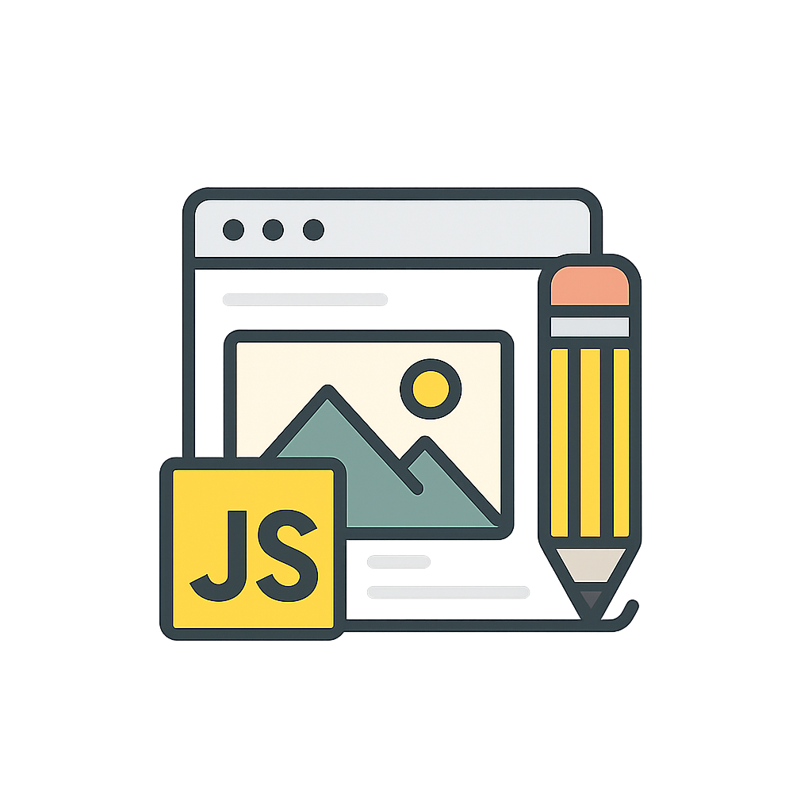

# JavaScript Mini Projects Collection



> A personal collection of small, beginner-friendly JavaScript projects focused on learning core concepts through hands-on building.

## 🌟 About This Repository

This repository contains a set of small JavaScript projects I built to practice DOM manipulation, event handling, basic algorithms, and UI interaction. Each project is self-contained inside its own folder and includes a simple HTML/CSS/JS structure so you can open and run each project immediately.

**Goal:** Learn by building — develop a clean portfolio of practical mini-projects and improve JavaScript fundamentals one project at a time.

---

## 📁 File / Project Structure

```
02-quiz-generator/
03-fd-calculator/
04-password-generator/
05-vowel-checker/
06-age-calculator/
07-tip-calculator/
08-to-do-list/
09-digital-clock/
10-expense-tracker/
11-poper-application/
12-ascii-unicode-detector/
13-music-player/
14-count-down-maker/
15-book-marker/
16-video-player/
api/
```

Each project folder typically contains:

* `index.html` — the main webpage for the project
* `styles.css` or `style.css` — styles for the project
* `script.js` — JavaScript file containing the project logic

---

## 🚀 Projects Included

> Click a project name to open its `index.html` in your browser (works locally).

### 02 - Quiz Generator

A small quiz app that presents multiple-choice questions, collects answers, and displays a score with feedback.

👉 [Open Quiz Generator](./02-quiz-generator/index.html)

---

### 03 - FD Calculator

Fixed Deposit calculator that computes maturity value given principal, rate of interest, and tenure.

👉 [Open FD Calculator](./03-fd-calculator/index.html)

---

### 04 - Password Generator

A utility to generate random passwords with options for length and inclusion of uppercase, numbers, and symbols.

👉 [Open Password Generator](./04-password-generator/index.html)

---

### 05 - Vowel Checker

Simple tool that checks whether the entered character is a vowel or not and displays the result.

👉 [Open Vowel Checker](./05-vowel-checker/index.html)

---

### 06 - Age Calculator

Calculate age based on a user-provided birthdate. Demonstrates date handling and basic arithmetic in JS.

👉 [Open Age Calculator](./06-age-calculator/index.html)

---

### 07 - Tip Calculator

Compute tip amount and total bill based on bill value and chosen tip percentage.

👉 [Open Tip Calculator](./07-tip-calculator/index.html)

---

### 08 - To-Do List

A simple to-do list app featuring add, remove, and persist (localStorage) functionality.

👉 [Open To-Do List](./08-to-do-list/index.html)

---

### 09 - Digital Clock

A real-time digital clock built with JavaScript that updates every second.

👉 [Open Digital Clock](./09-digital-clock/index.html)

---

### 10 - Expense Tracker

Basic expense tracker that allows adding expenses and viewing totals; a foundation for a more advanced finance app.

👉 [Open Expense Tracker](./10-expense-tracker/index.html)

---

### 11 - Popover Application

A small UI utility demonstrating popover behavior using JavaScript event handling and DOM manipulation.

👉 [Open Popover Application](./11-poper-application/index.html)

---

### 12 - ASCII / Unicode Detector

Tool to detect and display ASCII or Unicode values for user-entered characters.

👉 [Open ASCII / Unicode Detector](./12-ascii-unicode-detector/index.html)

---

### 13 - Music Player

A browser-based music player featuring playlist control, play/pause functionality, and audio handling using the HTML5 Audio API.

👉 [Open Music Player](./13-music-player/index.html)

---

### 14 - Countdown Maker

A countdown timer that calculates remaining time until a selected future date.

👉 [Open Countdown Maker](./14-count-down-maker/index.html)

---

### 15 - Bookmark Manager

A simple bookmark manager that allows saving, listing, and persisting website links using localStorage.

👉 [Open Bookmark Manager](./15-book-marker/index.html)

---

### 16 - Video Player

A custom video player with JavaScript-based controls demonstrating media event handling.

👉 [Open Video Player](./16-video-player/index.html)

---

## 🌐 API-Based Projects

Projects that demonstrate working with external APIs using Fetch API and async JavaScript.

---

### API 01 - Dictionary App

A dictionary application that fetches word meanings from an external API and displays definitions dynamically.

👉 [Open Dictionary App](./api/01-dictonary-app/index.html)

---

### API 02 - Quote Generator

Generates and displays random quotes fetched from a public API.

👉 [Open Quote Generator](./api/02-quote-generator/index.html)

---

### API 03 - Joke Teller

Fetches jokes from an external API and displays them dynamically.

👉 [Open Joke Teller](./api/03-joke-teller/index.html)

---

### API 04 - Image Search

Search for images using an external image API and display results dynamically.

👉 [Open Image Search](./api/04-image-search/index.html)

---

### API 05 - Infinity Scroll

Implements infinite scrolling by loading new content dynamically as the user scrolls.

👉 [Open Infinity Scroll](./api/05-infinity-scroll/index.html)

---

### API 06 - Picture in Picture

Demonstrates the Picture-in-Picture Web API using video elements.

👉 [Open Picture in Picture](./api/06-picture-in-picture/index.html)

---

## 🧰 How to Use / Run Locally

1. Clone this repository:

```bash
git clone <your-repo-url>
cd <repo-folder>
```

2. Open any project in your browser by double-clicking the `index.html` file or serve the repo using a simple static server (recommended for consistent behavior):

```bash
# using Python 3
python -m http.server 8000
# then open http://localhost:8000/02-quiz-generator/
```

3. Modify HTML/CSS/JS files to experiment and learn.

---

## ✅ Contributing

Contributions and improvements are welcome! A few suggestions:

* Add comments and documentation to JavaScript files for readability.
* Improve styling and responsive behavior in CSS.
* Add tests or validation where appropriate (e.g., input validation for calculators).
* Create new mini-projects and follow the same folder structure.

If you'd like to contribute, open a PR describing the change.

---

## 📝 Notes & TODO

* Standardize naming of `styles.css` vs `style.css` across projects.
* Add README files inside complex project folders to describe specific features and usage.
* Add small screenshots or GIF demos for each project in `assets/`.

---

## 📬 Contact

**Georgekutty Jose**  
Email: [georgekuttyjose84@gmail.com](mailto:georgekuttyjose84@gmail.com)  
GitHub: [https://github.com/georgekuttyjose84](https://github.com/georgekuttyjose84)

---

## 📜 License

This repository is available under the **MIT License**. See `LICENSE` for details.

---

*Happy coding — build, break, fix, repeat!*
